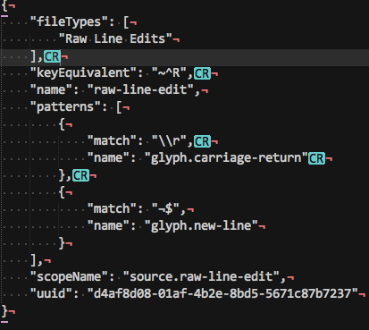

[![Build][github-ci-image]][github-ci-link]
[![Package Control Downloads][pc-image]][pc-link]
![License][license-image]
# RawLineEdit

View and edit line endings in Sublime Text.  RawLineEdit displays line endings very clearly and allows changing the line
endings per line (something sublime text doesn't allow out of the box).

# Documentation

http://facelessuser.github.io/RawLineEdit/

# License

Raw Line Edit is released under the MIT license.

Copyright (c) 2013 - 2019 Isaac Muse <isaacmuse@gmail.com>

Permission is hereby granted, free of charge, to any person obtaining a copy of this software and associated
documentation files (the "Software"), to deal in the Software without restriction, including without limitation the
rights to use, copy, modify, merge, publish, distribute, sublicense, and/or sell copies of the Software, and to permit
persons to whom the Software is furnished to do so, subject to the following conditions:

The above copyright notice and this permission notice shall be included in all copies or substantial portions of the
Software.

THE SOFTWARE IS PROVIDED "AS IS", WITHOUT WARRANTY OF ANY KIND, EXPRESS OR IMPLIED, INCLUDING BUT NOT LIMITED TO THE
WARRANTIES OF MERCHANTABILITY, FITNESS FOR A PARTICULAR PURPOSE AND NONINFRINGEMENT. IN NO EVENT SHALL THE AUTHORS OR
COPYRIGHT HOLDERS BE LIABLE FOR ANY CLAIM, DAMAGES OR OTHER LIABILITY, WHETHER IN AN ACTION OF CONTRACT, TORT OR
OTHERWISE, ARISING FROM, OUT OF OR IN CONNECTION WITH THE SOFTWARE OR THE USE OR OTHER DEALINGS IN THE SOFTWARE.

[github-ci-image]: https://github.com/facelessuser/RawLineEdit/workflows/build/badge.svg
[github-ci-link]: https://github.com/facelessuser/RawLineEdit/actions?workflow=build
[pc-image]: https://img.shields.io/packagecontrol/dt/RawLineEdit.svg?logo=sublime%20text&logoColor=cccccc
[pc-link]: https://packagecontrol.io/packages/RawLineEdit
[license-image]: https://img.shields.io/badge/license-MIT-blue.svg
