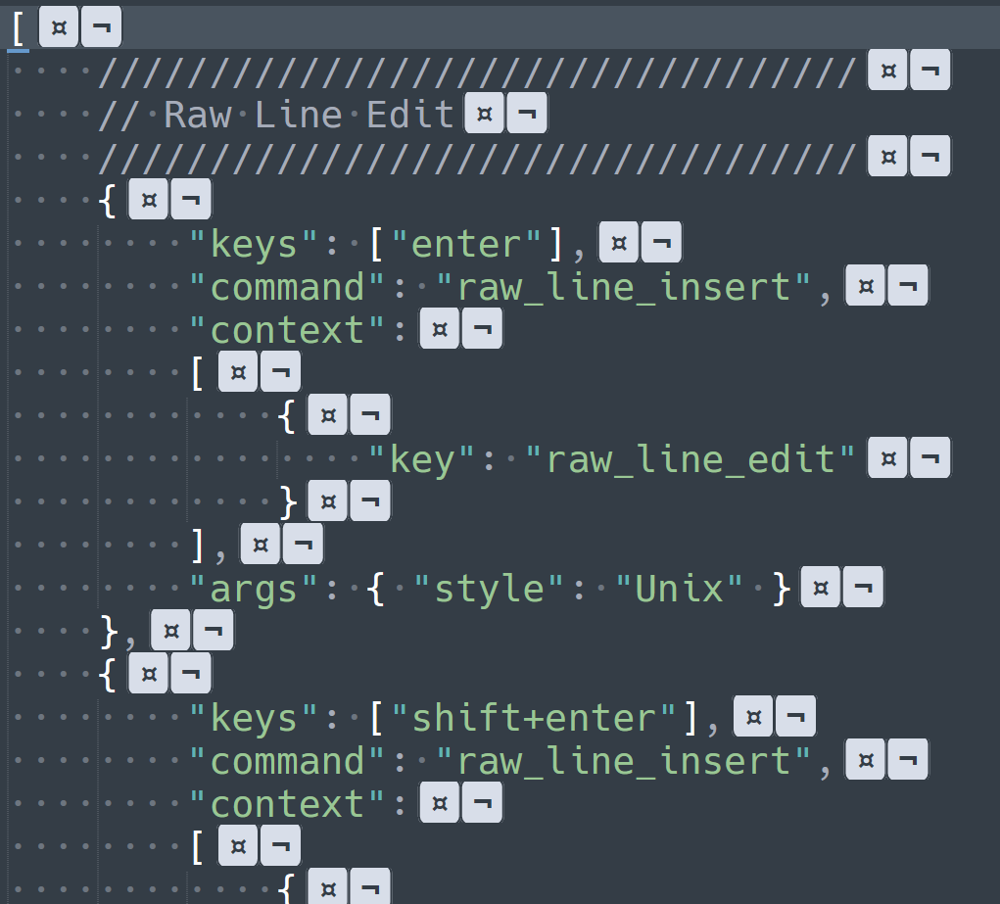

[![Donate via PayPal][donate-image]][donate-link]
[![Package Control Downloads][pc-image]][pc-link]
![License][license-image]
# RawLineEdit

View and edit line endings in Sublime Text.  RawLineEdit displays line endings very clearly and allows changing the line
endings per line (something sublime text doesn't allow out of the box).

# Documentation

http://facelessuser.github.io/RawLineEdit/

# License

Raw Line Edit is released under the MIT license.

[pc-image]: https://img.shields.io/packagecontrol/dt/RawLineEdit.svg?logo=sublime%20text&logoColor=cccccc
[pc-link]: https://packagecontrol.io/packages/RawLineEdit
[license-image]: https://img.shields.io/badge/license-MIT-blue.svg
[donate-image]: https://img.shields.io/badge/Donate-PayPal-3fabd1?logo=paypal
[donate-link]: https://www.paypal.me/facelessuser
